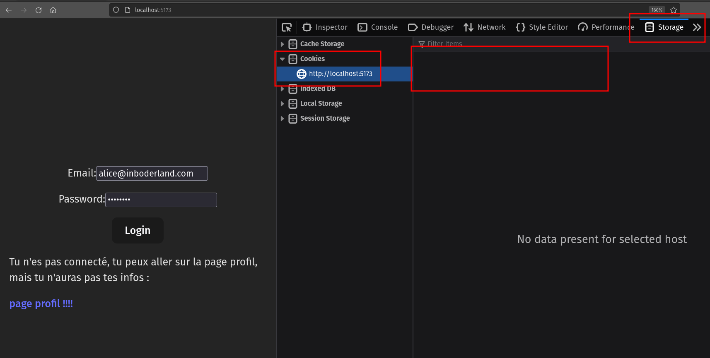
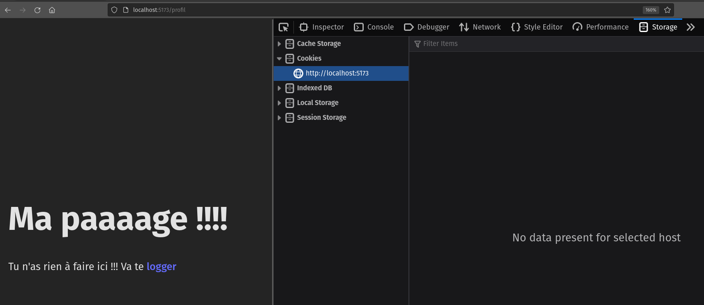
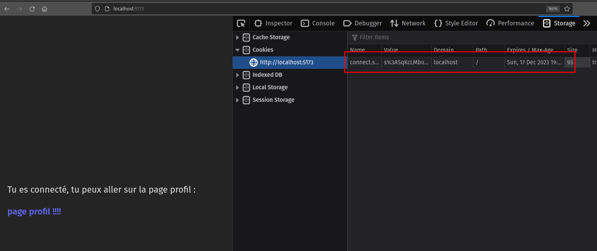
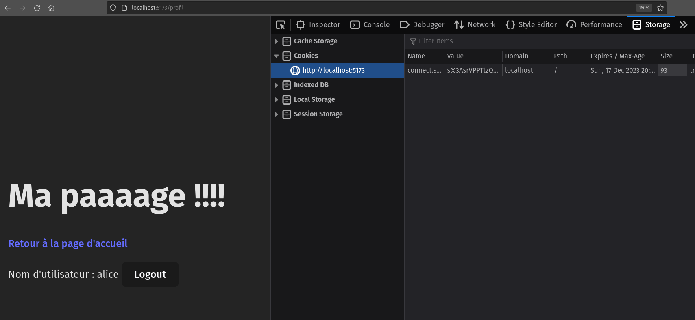

# React + Vite

## Table des Matières

- [Installation et Démarrage](#installation-et-démarrage)
- [Explications](#explications)

## Installation et Démarrage

Suivez ces étapes pour installer et démarrer votre application React avec Vite.

### Installation

1. **Cloner le dépôt** :
   Ouvrez un terminal et exécutez la commande suivante pour cloner le dépôt de votre projet :

   ```
   git clone [url_de_votre_dépôt]
   ```

2. **Accéder au dossier du projet** :
   Une fois le clonage terminé, accédez au dossier de votre projet :

   ```
   cd [nom_du_dossier]
   ```

3. **Installer les dépendances** :
   Exécutez la commande suivante pour installer les dépendances nécessaires au projet :

   ```
   npm install
   ```

### Démarrage de l'Application

Pour lancer votre application React avec Vite, suivez ces étapes :

1. **Démarrer le serveur de développement** :
   Exécutez la commande suivante pour démarrer le serveur de développement de Vite :

   ```
   npm run dev
   ```

2. **Accéder à l'application** :
   Une fois le serveur de développement en cours d'exécution, ouvrez votre navigateur et accédez à [http://localhost:5173](http://localhost:5173) (ou l'URL fournie dans votre console) pour voir votre application en action.

## Explications

### Step 1

[`Mode déconnecté (visiteur)`]

Alice accède à l'application, mais n'est pas encore connectée. Elle pourrait se rendre sur la _page profil_ mais elle n'y verrait pas d'information (elle ne pourrait même pas s'y rendre dans un vrai cas, mais c'est pour l'exemple hein 😁).

On note qu'à ce stade, comme elle n'est pas connectée, les cookies sont vides.
On peut le voir dans les dev tools `Storage > Cookies > http://localhost:5173 (qui est l'url de l'application)` avec Firefox ou `Application > Cookies > http://localhost:5173 (qui est l'url de l'application)` avec Chrome :



Si Alice se rend sur la page profil quand même (c'est une guedin Alice 🤣) voici ce qu'elle obtient :



C'est-à-dire pas grand-chose puisqu'elle n'est pas connectée. Le server ne peut pas l'identifier.

ℹ️ pour info, la page front accessible depuis http://localhost:5173/profil exécute la requête suivante :

```jsx
useEffect(() => {
  // ne faites pas attention au useEffect, c'est du react, l'important est la requete pour récuperer les infos du profil
  const fetchProfilData = async () => {
    try {
      // Voici la requete fetch pour récupérer les données du profil
      const response = await fetch("http://localhost:3000/me", {
        credentials: "include",
      });
      // Si le serveur répond avec un code d'erreur, on le gère et on s'arrete ici
      if (!response.ok) {
        throw new Error(`Erreur HTTP ! statut : ${response.status}`);
      }
      // Si tout se passe bien, on récupère les données en JSON
      const data = await response.json();
      // Et on met à jour le state avec les données du profil
      setProfilData(data);
    } catch (error) {
      console.error(
        "Erreur lors de la récupération des données du profil",
        error
      );
    }
  };

  fetchProfilData();
}, []);
```

Et côté back, il intercepte la requête sur cette route :

```js
app.get("/me", (req, res) => {
  console.log(req.session);
  if (!req.session.isAuth) {
    return res.status(401).json("Non authentifié");
  }
  res.json(req.session.user);
});
```

### Step 2

[`Mode connecté`]

Du coup, Alice n'a d'autre choix que de retourner sur la page précédente et de se logger en cliquant sur... le bouton _Login_



En faisant cela, le server a pu vérifier que l'identifiant et le mot de passe étaient les bons, il a créé une `session` (voir les explications dans le repo [back](https://github.com/O-clock-Cheesecake/auth-back)) et a envoyé le cookie qui sera géré automatiquement par le navigateur.

Du côté front, vous n'avez plus rien à faire, le cookie sera transmis au back à chaque requête (grâce au parametre `credentials: "include"`), jusqu'à la déconnexion...

En cliquant sur le lien "page profil !!!!", le front refait la requête pour récupérer les informations de l'utilisateur. Le cookie étant transmis grâce au parametre `credentials: "include"` dans la requête. Le cookie contient l'id de la session stocké côté back (session qui contient les informations de l'utilisateur) et le back transmet les infos du user au front pour qu'il les affiche 🎉



### Step 3

[`Mode déconnecté`]

Alice souhaite maintenant se déconnecter. Elle clique sur le bouton _Logout_.

Ceci déclenche la requête vers la route back gérant la déconnexion :

```jsx
const handleLogout = async () => {
  try {
    // On envoie la requete vers la bonne route back
    await fetch("http://localhost:3000/logout", {
      method: "POST",
      credentials: "include", // ici on envoi le cookie pour la gestion des sessions (le "credentials: include" est obligatoire pour envoyer le cookie, sinon le cookie ne sera pas envoyé)
    });
    // On redirige vers la page de connexion (ou d'accueil dans notre cas) après la déconnexion.
    navigate("/"); // on utilise la fonction navigate de react-router-dom, pour svelte, il faut utiliser l'équivalent.
  } catch (error) {
    console.error("Erreur lors de la déconnexion", error);
  }
};
```

Côté back, sur la route `/logout`, il retrouve la bonne session grâce au cookie et... (voir les commentaires dans le code ci-dessous) :

```js
app.post("/logout", (req, res) => {
  // il supprime la session
  req.session.destroy();
  // demande au navigateur de supprimer le cookie
  res.clearCookie("connect.sid");
  // et c'est tout
  res.status(200).json({ message: "Déconnexion réussie" });
});
```

De retour sur la page d'accueil, grâce à la redirection au "logout", le cookie a disparu et Alice est de nouveau déconnectée 😌


